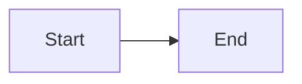

# reading-notes-101n6
=========
# MANUAL MD
## Heading 2
### Heading 3
#### Heading 4
##### Heading 5
###### Heading 6

# separadores
Heading 1
=========
Heading 2
---------

# formato
_Italic_
*Italic*
__Bold__
**Bold**
~~Strikethrough~~
Subscript~example~
Superscript^example^

# Listas
- Unordered list
+ Unordered list
* Unordered list
- Nested
  - Unordered
  - List
1. Ordered list
1) Ordered list
1. Nested
   1. Ordered
   2. List
# MARCADORES
+ [ ] Unchecked task
* [x] Checked task
- [ ] Nested
  - [x] Checked
  - [ ] Task
# LINKS
[Link](notable.md)
[Link reference][1]
[1]: notable.md
[Link](notable.md "Title")
[Link reference][1]
[1]: notable.md "Title"

# Autolink
https://notable.md
<https://notable.md>
fabio@notable.md
<fabio@notable.md>
# IMAGENES
![Image]
(https://notable.md/favicon.ico)
![Image reference][1]
[![Image reference + Link][1]][1]
[1]: https://notable.md/favicon.ico

# NOTACIONES
Numeric [^1]
Alphanumeric [^fn]
Inline ^[Inline content]
[^1]: Numeric content
[^fn]: Alphanumeric content
# ANOTACIONES
> Quotation
> > Nested quotation
# CODIGO
`Inline code`
``2` inline code``
```3` inline code```
    Unfenced code block
```
Fenced code block
```
~~~
Fenced code block
~~~
```js
// Fenced JS code block
```

Inline code
2` inline code
3` inline code
Unfenced code block
Fenced code block
Fenced code block
// Fenced JS code block
# TABLAS
#### Regular
| Tables | Are | Great |
| ------ | --- | ----- |
| •      | •   | •     |
| •      | •   | •     |
#### Aligned
| Left | Center | Right |
| :--- | :----: | ----: |
| •    | •      | •     |

# SEPARADORES

---
***
___

# EMOJIS
:smile: :+1:
# DIAGRAMAS


